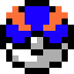

# Pokémon Orange and Blue

__Created by The Elite Four:__ Jason Corriveau, Eric Marshall, Ben Matase,
                                Alexander Murph

__Started:__ April, 2016

__Readme.md last updated:__ 5/2/16

## Jump To...
- [Description](#description "Go to Description")
- [Controls](#controls "Go to Controls")
- [Compiling](#compiling "Go to Compiling")
- [Running](#running "Go to Running")
- [Features](#features "Go to Features")
- [Credits](#credits "Go to Credits")
- [Disclaimer](#disclaimer "Go to Disclaimer")

## Description

This is our final project for Software Engineering and Design (CSCI205). A new
take on Pokémon, set at Bucknell University.  We aimed to mimic the look and
feel of a real Pokémon game, particularly the 3rd generation games (Ruby,
Sapphire, Emerald, Fire Red, and Leaf Green).  We put guest appearances by
Bucknell University professors as gym leaders with their permission.  As of
updating this readme, we have gotten the battling in working order.  The
user can choose a team of Pokémon from the first four generations with any
moves that the Pokémon could learn in the game.  The player can choose to
battle either a random trainer or the next professor or Elite Four member.
The Elite Four consists of the four creators of the game. The game right now
focuses on the battle sequence and has a lot of the functionality that the
real games have.  Only physical moves are included and only the damage of
the moves counts (no extra functions of all moves are accounted for).

The player can choose their team in the beginning of the game after
getting past the splash screen.  The user can click on any of the 6 buttons
and a panel will appear where there is a drop down list of all choosable
Pokémon.  Once a Pokmeon is chosen, the moves part appears and the user
can choose up to four moves for that Pokémon.  If everything is valid and
the user clicks the done button, that Pokémon is populated into the button
that the user clicked originally.  The user can also click the random
button to randomly populate all 6 Pokémon slots.  The user can click done
when they are finished editing their Pokémon team.

At the menu screen, the user can choose to battle a random trainer who
has 6 random Pokémon with 4 random moves, the next professor/Elite Four
member, or to reset their game and choose new Pokémon.  The professors are
given an order from first to eighth.  You can only advance to the next
professor by beating the current one.  When you beat Professor King, you
start to battle the Elite Four, which is the four creators of this game.
Created using the Scrum methodology.

A battle in Pokémon happens as such.  There are two Pokémon trainers in
every battle.  There is one trainer who is the player of the game and one
trainer who is the NPC (Non-Player Character). Each player has their image
show on the screen and then the NPC says some dialog to the player.  They
both send out their first Pokémon.  The trainers simultaneously choose a
move for their Pokémon to use or whether they will switch out their current
Pokémon for one in their bag.  Once both have chosen, calculations based on
each Pokémon's speed occur to determine which Pokémon will attack first.
Then the faster Pokémon performs their attack and the defending Pokémon loses
HP (Hit Points) according to an equation based on many things including
attacking Pokémon's attack, defending Pokémon's defense, Pokémon types,
attacking Pokémon's move's type and other factors.  If the opposing Pokémon
faints (has no HP left), then that is the end of the battle sequence and the
trainer whose Pokémon fainted chooses a new one to switch out.  If the
defending Pokémon does not faint, then it loses the appropriate HP and
performs its move.  If the then defending Pokémon faints, then the
trainer chooses which Pokémon to send out.  This cycle of battle sequences
happen until one trainer has no Pokémon left to send out and the trainer
with Pokémon left is considered the winner.

## Controls

### Menu
- __Keys__
    - Arrow Keys to navigate between buttons in the menus
    - Space/Enter to select the currently highlighted button and have it operate its function
    - Backspace will exit out of a menu if the operation is allowed
- __Mouse__
    - Click to select a button

## Compiling

1. Download and install Java JDK 8
    ([Download](http://www.oracle.com/technetwork/java/javase/downloads/index.html "Download Java"))
2. Download and install Netbeans ([Download](https://netbeans.org/ "Download Netbeans"))
3. Download JarSplice ([Download](http://ninjacave.com/jarsplice "Download Jarsplice"))
4. Clone the repository in the directory of your choice
5. In Netbeans, select __Run > Clean and Build Project__
6. Open JarSplice
    1. Select __ADD JARS__ and add the following Jar files _(Note: paths are relative to the project folder)_:
        - dist/__csci205FinalProject.jar__
        - dist/lib/__commons-lang3-3.4.jar__
        - dist/lib/__ibxm.jar__
        - dist/lib/__jdom-2.0.6.jar__
        - dist/lib/__jinput.jar__
        - dist/lib/__jogg-0.0.7.jar__
        - dist/lib/__jorbis-0.0.15.jar__
        - dist/lib/__lwjgl.jar__
        - dist/lib/__slick.jar__
    - Select __ADD NATIVES__ and add all of the files found at:
        - externals/Slick/native/
    - Select __MAIN CLASS__
        - Under __Enter Main Class__ enter:
            - `Main`
        - Select __Show Options__ and under __Set VM Arguments__ enter:
            - `-Djava.library.path="./externals/Slick/native"`
    - Select __CREATE FAT JAR__ and select the __Create Fat Jar__ button
    - Choose where you would like to save the game

## Running
- __Graphical File System__ (Finder/Nautilus/Windows Explorer)
    1. Navigate to the folder containing the compiled fat jar (see __Compiling__ for details)
    2. Make sure the file has run permissions
    3. Double click on the file
- __Command Line__
    1. Navigate to the folder containing the compiled fat jar (see __Compiling__ for details)
    2. Make sure the file has run permissions
    3. Run `java -jar [your_fat_jar_filename].jar`

## Features
- [x] Splash screen
- [x] Pokémon and trainer objects
- [x] Battle calculator and interactions
- [x] Load Pokémon data from XML
- [x] Battle GUI
- [x] Simple Animations
- [x] Sound & Music
- [x] Main Menu
- [ ] Overworld GUI
- [ ] Overworld interactions

## Credits
- Special thanks to all of the Bucknell University professors that let us use their names in
    the game

- This project uses the [Slick2D Engine](http://slick.ninjacave.com/ "Slick2D Website"), a wrapper
    around the [Lightweight Java Game Library](https://www.lwjgl.org/ "LWJGL Website")

- For parsing the XML files, we used [JDOM](http://www.jdom.org/ "JDOM Website")

- All Pokémon sprites were found at [Veekun](http://veekun.com/dex/downloads "Veekun Website")

- Thanks to _cathyjf_ and _r4vi_ on Github for the
    [moves Database](https://github.com/cathyjf/PokémonLabBot/blob/master/moves.xml "Moves Database on Github")
    and [Pokémon Database](https://github.com/r4vi/zipper-demo/blob/master/resources/Pokémon.xml "Pokémon Database on Github")
    respectively

- Trainer Sprites were found on [Psypokes.com](http://i32.tinypic.com/n4blzt.jpg "Psypokes Website")

## Disclaimer
This game does not represent the views of Bucknell University or Nintendo Co., Ltd.

Pokémon and its trademarks are ©1995-2016 Nintendo, Creatures, GAMEFREAK and the The Pokémon Company International, Inc. All images in this game are © of their respective owners. Pokémon Orange and Blue is a non-commercial Pokémon® fan game, and means no copyright infringement.
